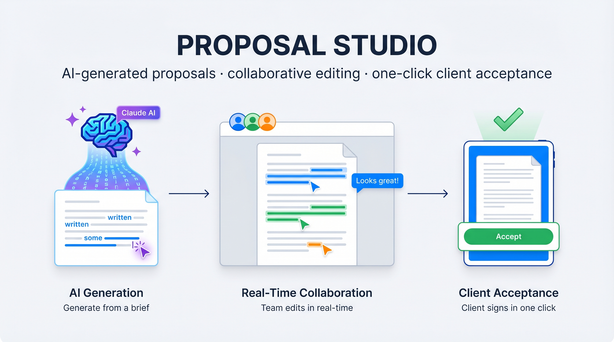
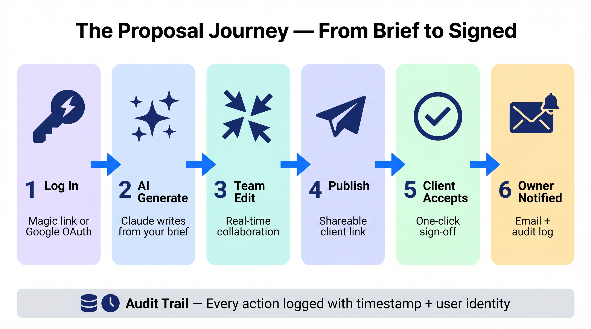
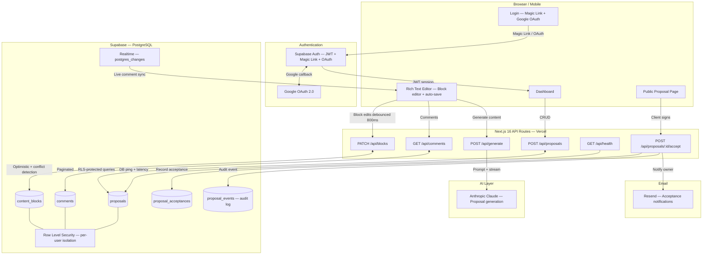
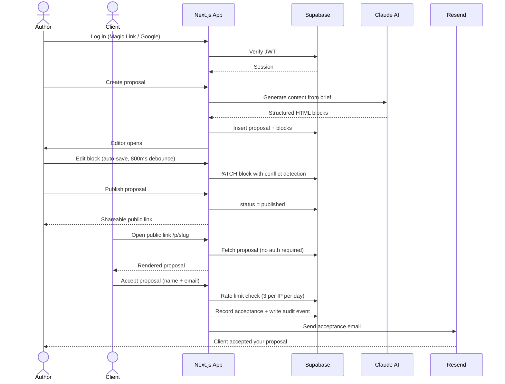
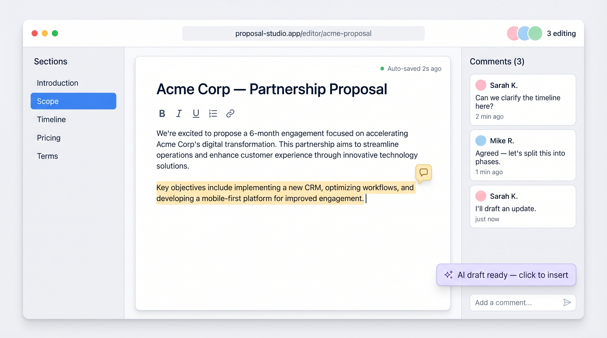

# Proposal Studio

**A production-grade collaborative proposal editor** for agencies and consultants — create pixel-perfect client proposals, edit them in real-time with your team, generate content with AI, and close deals with one-click client acceptance.

> Built with Next.js 16, Supabase, Anthropic Claude, and Vercel. Deployed to production with full auth, audit trail, real-time sync, and security hardening.

---

## What it does



**Author logs in → creates proposal → AI generates content → team edits in real-time → publishes shareable link → client views + accepts → owner gets email notification.**

Every action is logged to an append-only audit trail with timestamp and user identity.

---

## Architecture



---

## Request Flow



---

## Stack

| Layer | Technology | Why |
|---|---|---|
| Framework | Next.js 16 — App Router | Server components, async params, Edge-compatible middleware |
| Language | TypeScript — strict mode | Catches entire classes of runtime bugs at compile time |
| Styling | Tailwind CSS v4 | Zero-runtime CSS, co-located with components |
| Editor | Custom block editor | Contenteditable blocks — full control over rendering and serialization |
| Database | Supabase (PostgreSQL + Auth + Realtime) | RLS at DB layer, built-in auth, real-time subscriptions |
| AI | Anthropic Claude via AI SDK | Best-in-class instruction following for structured document generation |
| Email | Resend | Transactional email with high deliverability |
| Deployment | Vercel | Zero-config serverless, instant previews per branch |
| Tests | Vitest | Fast, native ESM, compatible with React 19 |

---

## Screenshot



The block editor supports inline formatting, section navigation, real-time comment threads via Supabase Realtime, auto-save with conflict detection, and inline AI assistance — all while three team members edit the same proposal simultaneously.

---

## Features

| Feature | Detail |
|---|---|
| **AI proposal generation** | Claude generates full proposals from a brief — title, sections, pricing blocks |
| **Rich text editing** | Custom block editor with inline formatting, block structure, section sidebar navigation |
| **Real-time comments** | Supabase Realtime syncs comments live across all open sessions with dedup |
| **Inline comment editing** | Add, resolve, and edit comment threads directly on highlighted text |
| **Auto-save** | Debounced 800ms write on every keystroke — no manual save button |
| **Conflict detection** | Block edits detect concurrent changes and surface a conflict warning |
| **Client acceptance** | Public shareable link with sign-off form; email sent to owner on acceptance |
| **Block version history** | Revert any content block to its previous saved version |
| **Audit trail** | Every key action logged to `proposal_events` with user identity + timestamp |
| **Soft delete + restore** | Proposals recoverable after deletion — `deleted_at` pattern, not hard delete |
| **Health endpoint** | `GET /api/health` returns DB ping latency and live service status (200/503) |
| **Google OAuth** | One-click sign-in alongside passwordless magic link |
| **Dashboard skeleton** | Staggered skeleton UI renders instantly during server-side data fetch |
| **Import from HTML** | Paste or upload any HTML proposal; parser extracts blocks automatically |

---

## Security

| Control | Implementation |
|---|---|
| **Row Level Security** | All tables enforce per-user isolation at the database level — no app-layer bypass is possible |
| **Passwordless auth** | Magic link + Google OAuth via Supabase — no passwords stored anywhere |
| **CSRF protection** | Origin header validation on public endpoints; fails closed if `APP_URL` is unset |
| **Cookie security** | Auth cookies enforced with `SameSite=Lax`, `Secure` (production), `HttpOnly` |
| **Rate limiting** | Supabase-backed IP counter — consistent across all Vercel serverless instances |
| **Sandbox isolation** | Proposal HTML rendered in `<iframe sandbox="allow-scripts">` — `allow-same-origin` intentionally excluded to prevent sandbox escape |
| **Security headers** | `X-Content-Type-Options`, `X-Frame-Options: DENY`, `Strict-Transport-Security`, `Permissions-Policy`, `Cache-Control: no-store` on every response |
| **Structured logging** | JSON log lines in production; stack traces stripped so implementation details never leak |
| **Audit log** | Written via service role key to `proposal_events`; RLS blocks client reads |
| **Input validation** | UUID format checked on all ID params; field length limits enforced via shared constants |
| **Soft delete only** | No hard deletes on proposals — `deleted_at` timestamp + restore endpoint |
| **Environment validation** | All required env vars validated at startup; app fails fast with a clear error message |

---

## Project Structure

```
src/
├── app/
│   ├── api/
│   │   ├── proposals/[id]/     CRUD · publish · restore · accept · stats · duplicate · export
│   │   ├── blocks/[id]/        Block edit + version revert
│   │   ├── comments/           Threaded comments — create, edit, delete
│   │   ├── generate/           AI proposal generation (Claude)
│   │   └── health/             Uptime check + DB latency
│   ├── p/[slug]/               Public proposal view + inline editor
│   ├── login/                  Magic link + Google OAuth
│   └── page.tsx                Dashboard with view stats + acceptance status
├── components/
│   ├── dashboard/              Proposal grid, cards, skeleton, create modal
│   ├── editor/                 Toolbar, realtime comment panel, section sidebar
│   └── proposal/               Public renderer (sandboxed iframe), accept button
├── lib/
│   ├── ai/                     Claude prompt engineering + generation logic
│   ├── email/                  Resend transactional email templates
│   ├── supabase/               SSR server client + browser client
│   ├── api.ts                  Shared security headers + ok/err response helpers
│   ├── audit.ts                Audit event writer (service role, fire-and-forget)
│   ├── constants.ts            Rate limits, field limits, timeouts — single source of truth
│   ├── env.ts                  Startup env validation with typed accessors
│   └── logger.ts               Structured JSON logger — stack traces stripped in production
└── middleware.ts               Auth guard + security headers (re-exports from proxy.ts)
```

---

## Local Development

```bash
# 1. Install dependencies
npm install

# 2. Copy environment template and fill in values
cp .env.example .env.local

# 3. Start dev server
npm run dev

# 4. Run tests
npm test

# 5. Type-check + production build
npm run build
```

---

## Environment Variables

| Variable | Description |
|---|---|
| `NEXT_PUBLIC_SUPABASE_URL` | Supabase project URL |
| `NEXT_PUBLIC_SUPABASE_ANON_KEY` | Supabase anon key — safe to expose to the browser |
| `SUPABASE_SERVICE_ROLE_KEY` | Service role key — **server-only**, never sent to the client |
| `NEXT_PUBLIC_APP_URL` | Production URL — used for OAuth redirects and CSRF origin validation |
| `RESEND_API_KEY` | Resend API key for transactional email |
| `ANTHROPIC_API_KEY` | Anthropic Claude API key for AI proposal generation |

See `.env.example` for the full template.

---

## Tests

```bash
npm test                # 40 tests, ~330ms
npm run test:watch      # Watch mode
npm run test:coverage   # v8 coverage report
```

| File | Coverage |
|---|---|
| `lib/utils.ts` | `slugify`, `formatDate`, `debounce` — 14 tests |
| `lib/utils/format-time.ts` | `formatRelativeTime` with Vitest fake timers — 7 tests |
| `lib/utils/strip-editor-artifacts.ts` | HTML cleanup, idempotency, passthrough — 11 tests |
| `lib/logger.ts` | Log routing, error context, stack trace stripping — 8 tests |
