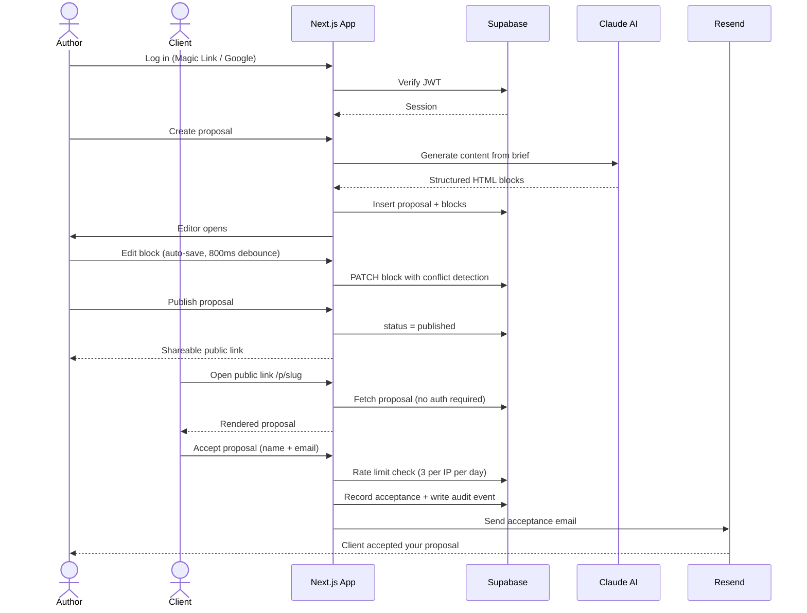

# Proposal Studio

> A production-grade collaborative proposal editor built for agencies and consultants. Create pixel-perfect client proposals, edit them in real-time with your team, generate content with AI, and close deals with one-click client acceptance.

**Live demo:** [proposal-studio-mu.vercel.app](https://proposal-studio-mu.vercel.app)

---

## Architecture


---

## Request Flow



---

## Features

| Feature | Detail |
|---|---|
| **Rich text editing** | Tiptap editor with inline formatting, block structure, section sidebar |
| **AI generation** | Claude generates full proposals from a brief — title, sections, pricing |
| **Real-time collaboration** | Supabase Realtime syncs comments live across all open sessions |
| **Inline comments** | Highlight text → add comment → resolve or edit threads |
| **Auto-save** | Debounced 800ms write on every keystroke — no manual save button |
| **Client acceptance** | Public page with sign-off form; email notification to proposal owner |
| **Audit trail** | Every key action logged to `proposal_events` with user + timestamp |
| **Soft delete** | Proposals recoverable — `deleted_at` pattern with restore endpoint |
| **Health endpoint** | `/api/health` returns DB latency and live service status |
| **Google OAuth** | One-click sign-in alongside passwordless magic link |
| **Dashboard skeleton** | Instant skeleton UI during server-side data fetch |
| **Block history** | Revert any content block to its previous version |

---

## Security

| Control | Implementation |
|---|---|
| **Row Level Security** | All Supabase tables enforce per-user access at DB level — no app-layer bypass possible |
| **Auth** | JWT via Supabase; passwordless — no credentials stored |
| **CSRF protection** | Origin header validation on all public-facing endpoints |
| **Rate limiting** | Supabase-backed counter — safe across multiple Vercel serverless instances |
| **Structured logging** | JSON log lines in production; stack traces stripped to prevent info leakage |
| **Security headers** | `X-Content-Type-Options`, `X-Frame-Options`, `Referrer-Policy`, `Cache-Control: no-store` on all API responses |
| **Soft delete** | Hard deletes replaced with `deleted_at` + restore endpoint — always recoverable |
| **Input validation** | UUID validation on all ID params; field length limits via constants |
| **Audit log** | Service-role writes to `proposal_events`; protected by RLS from client reads |

---

## Stack

| Layer | Technology |
|---|---|
| Framework | Next.js 16 (App Router) + React 19 + React Compiler |
| Language | TypeScript (strict mode) |
| Styling | Tailwind CSS v4 |
| Editor | Tiptap (headless rich text) |
| Database | Supabase (PostgreSQL + Auth + Realtime + Storage) |
| AI | Anthropic Claude via Vercel AI SDK |
| Email | Resend |
| Deployment | Vercel |
| Tests | Vitest — 40 tests across core utilities |

---

## Project Structure

```
src/
├── app/
│   ├── api/
│   │   ├── proposals/[id]/     CRUD · publish · restore · accept · stats
│   │   ├── blocks/[id]/        Block edit + version revert
│   │   ├── comments/           Threaded comments (create, edit, delete)
│   │   ├── generate/           AI proposal generation
│   │   └── health/             Uptime check + DB latency
│   ├── p/[slug]/               Public proposal view + editor
│   ├── login/                  Magic link + Google OAuth
│   └── page.tsx                Dashboard
├── components/
│   ├── dashboard/              Proposal grid, cards, create modal
│   ├── editor/                 Toolbar, comment panel, section sidebar
│   └── proposal/               Public renderer, accept button
└── lib/
    ├── ai/                     Claude prompt + generation logic
    ├── email/                  Resend email templates
    ├── supabase/               Server + browser client helpers
    ├── api.ts                  Shared security headers + response helpers
    ├── audit.ts                Audit event writer (service role)
    ├── constants.ts            App-wide limits and thresholds
    ├── env.ts                  Environment validation at startup
    └── logger.ts               Structured JSON logger (prod-safe)
```

---

## Local Development

```bash
# 1. Install dependencies
npm install

# 2. Set up environment variables
cp .env.example .env.local
# Fill in the values — see Environment Variables section below

# 3. Start dev server
npm run dev

# 4. Run tests
npm test

# 5. Type check + production build
npm run build
```

---

## Environment Variables

| Variable | Required | Description |
|---|---|---|
| `NEXT_PUBLIC_SUPABASE_URL` | Yes | Supabase project URL |
| `NEXT_PUBLIC_SUPABASE_ANON_KEY` | Yes | Supabase anon key (safe to expose to browser) |
| `SUPABASE_SERVICE_ROLE_KEY` | Yes | Service role key — server-only, never expose to client |
| `NEXT_PUBLIC_APP_URL` | Yes | Production URL used for OAuth redirects and CSRF validation |
| `RESEND_API_KEY` | Yes | Resend API key for transactional email |
| `ANTHROPIC_API_KEY` | Yes | Anthropic Claude API key for AI proposal generation |

---

## Tests

```bash
npm test                # Run all 40 tests
npm run test:watch      # Watch mode
npm run test:coverage   # Coverage report (v8)
```

Test coverage across:
- `utils.ts` — `slugify`, `formatDate`, `debounce`
- `format-time.ts` — `formatRelativeTime` with fake timers
- `strip-editor-artifacts.ts` — HTML cleanup for Tiptap editor artifacts
- `logger.ts` — log level routing, error context extraction, stack trace handling
